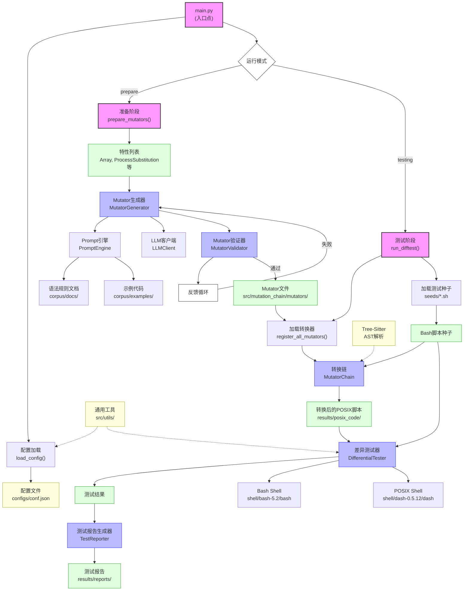

# bash-difftest

一个自动化蜕变差分测试框架。特点：

- 对 bash 和 dash(posix shell) 进行差分测试 
- 蜕变关系从 *相同语义突变* 思想出发
- 蜕变所用变异子通过 LLM 生成。

项目架构如下：

```mermaid
graph TD
    %% 主要入口点
    main["main.py<br>(入口点)"] --> config_loader["配置加载<br>load_config()"]
    config_loader --> config["配置文件<br>configs/conf.json"]
    main --> mode{"运行模式"}
    
    %% 准备阶段
    mode -->|prepare| prep["准备阶段<br>prepare_mutators()"]
    prep --> feature_list["特性列表<br>Array, ProcessSubstitution等"]
    
    feature_list --> generator["Mutator生成器<br>MutatorGenerator"]
    generator --> prompt_engine["Prompt引擎<br>PromptEngine"]
    prompt_engine --> docs["语法规则文档<br>corpus/docs/"]
    prompt_engine --> examples["示例代码<br>corpus/examples/"]
    generator --> llm["LLM客户端<br>LLMClient"]
    
    generator --> validator["Mutator验证器<br>MutatorValidator"]
    validator --> feedback["反馈循环"]
    feedback -->|失败| generator
    validator -->|通过| mutator_files["Mutator文件<br>src/mutation_chain/mutators/"]
    
    %% 测试阶段
    mode -->|testing| test["测试阶段<br>run_difftest()"]
    test --> load_mutators["加载转换器<br>register_all_mutators()"]
    mutator_files --> load_mutators
    load_mutators --> mutation_chain["转换链<br>MutatorChain"]
    
    test --> seed_loader["加载测试种子<br>seeds/*.sh"]
    seed_loader --> seed_files["Bash脚本种子"]
    
    seed_files --> mutation_chain
    mutation_chain --> posix_files["转换后的POSIX脚本<br>results/posix_code/"]
    
    seed_files --> diff_tester["差异测试器<br>DifferentialTester"]
    posix_files --> diff_tester
    diff_tester --> test_results["测试结果"]
    
    test_results --> reporter["测试报告生成器<br>TestReporter"]
    reporter --> report_files["测试报告<br>results/reports/"]
    
    %% Shell执行相关
    diff_tester --> bash["Bash Shell<br>shell/bash-5.2/bash"]
    diff_tester --> posix["POSIX Shell<br>shell/dash-0.5.12/dash"]
    
    %% 依赖和工具
    utils["通用工具<br>src/utils/"] -.-> config_loader
    utils -.-> diff_tester
    tree_sitter["Tree-Sitter<br>AST解析"] -.-> mutation_chain
    
    %% 样式定义
    classDef primary fill:#f9f,stroke:#333,stroke-width:2px;
    classDef secondary fill:#bbf,stroke:#33f,stroke-width:1px;
    classDef data fill:#dfd,stroke:#3a3,stroke-width:1px;
    classDef config fill:#ffd,stroke:#aa3,stroke-width:1px;
    classDef flow fill:#fff,stroke:#333,stroke-width:1px;
    
    class main,prep,test primary;
    class generator,validator,mutation_chain,diff_tester,reporter secondary;
    class feature_list,seed_files,mutator_files,posix_files,test_results,report_files data;
    class config,utils,tree_sitter config;
    class mode,feedback flow;
```

