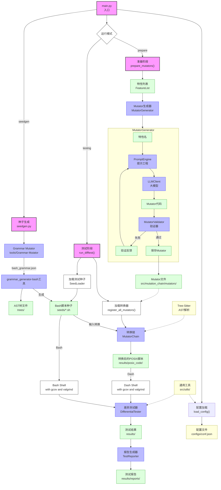

# bash-difftest

一个自动化蜕变差分测试框架。

## 特点

- 使用语法指导的方式生成大量测试种子。
- 对 bash 和 dash (posix shell) 进行差分测试 。
- 蜕变关系从 *相同语义突变* 思想出发。
- 蜕变所用变异子通过 LLM 生成和修正。

## 使用方式

目前提供了本地部署和容器部署两种方式。

- 本地部署（不建议）：将源码拉下来后，使用 `make init`初始化环境
  - 但由于环境复杂，不能保证不同机器上的本地部署一致。
  - 由于测试种子的不确定性，待测shell可能会对本地环境造成破坏。不建议本地部署。
- 容器部署：
  1. 使用 `docker pull grapefruitcat030/bash-difftest:dev` 拉取测试框架镜像；
  2. 进入 `/workspace` 目录，运行 `make test`，执行测试，过程可以使用 `ctrl+C` 停止测试，会自动生成测试报告到 `results/report` 目录。
  3. 测试完毕后，运行 `make coverage` 生成对应测试覆盖率报告。

## 项目架构

